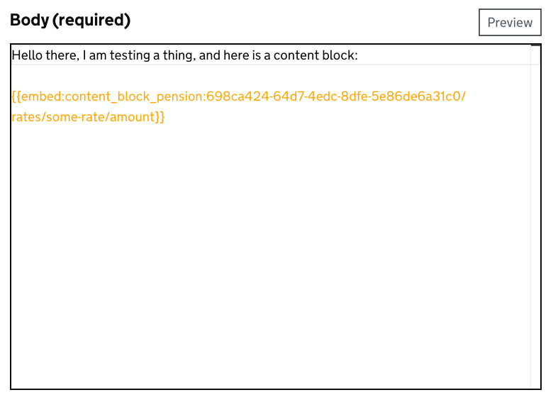

# Content Block Editor

A prototype using [Monaco Editor](https://microsoft.github.io/monaco-editor/) to demonstrate how we could highlight content blocks within publishing apps.

## Local development

1. Clone the repo
1. Install dependencies:

   ```bash
   npm install
   ```

1. Run the development server:

   ```bash
   npm run dev
   ```

1. Access the [Example editor](http://localhost:5173/)
1. Run tests

   ### Unit tests

   ```bash
   npm run test
   ```

   ### E2E tests (using [Playwright](https://playwright.dev/))

   ```bash
   npm run e2e-test
   ```

## Overview

The editor can be used as a "drop-in" replacement for textareas, allowing Content Block embed codes from
[Content Block Manager](https://docs.publishing.service.gov.uk/repos/whitehall/content_block_manager.html) to be
highlighted, and (in future) provide contextual information about the blocks.

Currently, all that the application does is highlight blocks like so:



In future, we'd like to:

- [ ] Add contextual information (using [`registerInlayHintsProvider`](https://microsoft.github.io/monaco-editor/typedoc/functions/languages.registerInlayHintsProvider.html))
- [ ] Add information about a block on hover (using [`registerHoverProvider`](https://microsoft.github.io/monaco-editor/typedoc/functions/languages.registerHoverProvider.html))
- [ ] Highlight invalid / not found blocks

All of the above require an API endpoint to be provided to provide information about blocks, which we don't (currently)
have.

Additionally, we can quite easily provide Markdown highlighting using [see the Markdown example here](https://microsoft.github.io/monaco-editor/monarch.html),
but we need to test the basic principle with users first.
